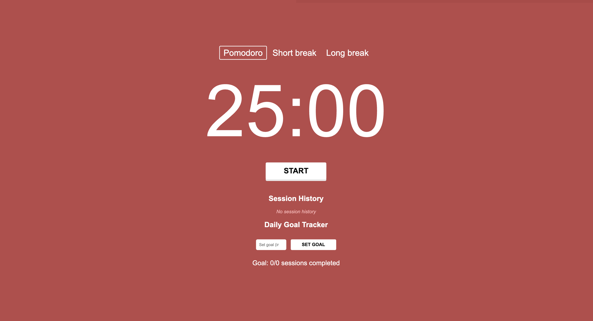

# Pomodoro Timer

A simple and effective web application to help users manage their time using the Pomodoro Technique. The Pomodoro Timer allows users to set work and break intervals to enhance productivity and focus.

## Features

- **Timer Functionality**: Start, stop, and reset the timer with ease.
- **Customizable Intervals**: Set your preferred work and break durations.
- **Responsive Design**: Works on desktops, tablets, and mobile devices.

## Technologies Used

- **Frontend**: HTML, CSS, JavaScript

